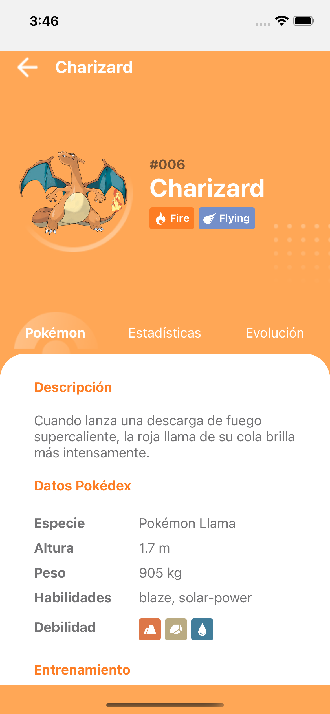

## Pokédex App
React Native exercise App that consumes an api (https://pokeapi.co/) and display info about Pokémons

    
    
    
    

- Desarrollada con React Native CLI
- Consta de 2 pantallas: 'Home' y 'PokemonInfo'
- Obtiene los datos de los Pokemons desde: 'https://pokeapi.co/'
- Lista los datos con FlatList cargando los datos progresivamente

## Instrucciones para correr el proyecto

- Clonar el repositorio con el comando "git clone git@github.com:antoniomefa/pokedex-app.git"
- Para instalar las dependencias ejecutar el comando "yarn install"
- Inicializar el proyecto con el comando "yarn postinstall"
- Iniciar el proyecto con el comanto "yarn start"
- Para ejecutar en android usa el comando "yarn android"
- Para ejecutar en ios usa el comando "yarn ios"

Por: Antonio Mendiola Farías - 2021